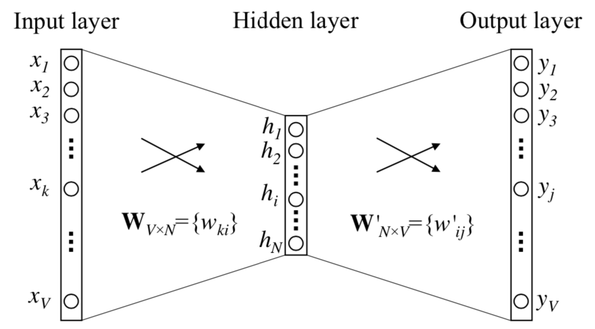

# word2vec Parameter Learning Explained
Xin Rong ronxin@umich.edu 

## 摘要
Mikolov 等人的文章中的 word2vec 模型和应用在最近两年里吸引了大量的注意。Word2vec 模型所学习的单词的向量表示已经被证明具有语义含义，并且在很多NLP任务中是有用的。当越来越多的研究者开始用 word2vec 或者类似的技术来进行实验时，我发现缺少一份综合性地详细解释单词嵌入模型的参数学习过程，这样会阻止非专业的神经网络研究人员理解这个模型的工作方法。

这篇文章提供了 word2vec 模型的参数更新方程的详细推导和解释，包括原始的连续词袋模型（CBOW）和 skip-gram 模型（SG），以及高级的优化技术，包括分层softmax和负采样（negative sampling）。对于梯度方程的直观解释也会在数学推导旁提供。

在附录中，还提供了一篇关于神经网络和反向传播（backpropagation）基础的综述。我还创建了一个交互性的演示，wevi，以便于直观地理解模型[1](#fn1)。

## 连续词袋模型
### 单个词语语境
我们从 [Mikolov 等人的文章（2013a）](#R2)中介绍的最简单的连续词袋模型（CBOW）开始，我们假定在每个语境下只考虑一个词，这意味着给定一个上下文单词这个模型将预测一个目标单词，就像一个双词模型（bigram model）一样。建议刚开始了解神经网络的读者在进一步阅读之前，先读一下附录A来大致了解一下重要的概念和术语。

    
     
    
A simple CBOW model with only one word in the context

图示1展示了简化上下文定义下的神经网络。在我们的定义中，词汇量大小为V，隐藏层大小为N。相邻图层上的单元是全连接的。输入是一个一位有效（one-hot）编码的向量，这意味着对于一个给定的上下文单词输入，V单元{x1, · · · , xV }中将只有一个会是1，其他的会是0。

## 文章中的注脚
1、可以从这里查看这个演示: http://bit.ly/wevi-online.

## 参考文献

Mikolov, T., Chen, K., Corrado, G., and Dean, J. (2013a). Efficient estimation of word representations in vector space. arXiv preprint arXiv:1301.3781.