# word2vec Parameter Learning Explained
Xin Rong ronxin@umich.edu 

## 摘要
Mikolov 等人的文章中的 word2vec 模型和应用在最近两年里吸引了大量的注意。Word2vec 模型所学习的单词的向量表示已经被证明具有语义含义，并且在很多NLP任务中是有用的。当越来越多的研究者开始用 word2vec 或者类似的技术来进行实验时，我发现缺少一份综合性地详细解释单词嵌入模型的参数学习过程，这样会阻止非专业的神经网络研究人员理解这个模型的工作方法。

这篇文章提供了 word2vec 模型的参数更新方程的详细推导和解释，包括原始的连续词袋模型（CBOW）和 skip-gram 模型（SG），以及高级的优化技术，包括分层softmax和负采样（negative sampling）。对于梯度方程的直观解释也会在数学推导旁提供。

在附录中，还提供了一篇关于神经网络和反向传播（backpropagation）基础的综述。我还创建了一个交互性的演示，wevi，以便于直观地理解模型[1](#fn1)。

## 1 连续词袋模型

### 1.1 单个上下文单词

我们从 [Mikolov 等人的文章（2013a）](#R2)中介绍的最简单的连续词袋模型（CBOW）开始，我们假定在每个语境下只考虑一个词，这意味着给定一个上下文单词这个模型将预测一个目标单词，就像一个双词模型（bigram model）一样。建议刚开始了解神经网络的读者在进一步阅读之前，先读一下附录A来大致了解一下重要的概念和术语。

    
     
    
一个语境中只有一个单词的简单CBOW模型

图示1展示了简化上下文定义下的神经网络。在我们的定义中，词汇量大小为V，隐藏层大小为N。相邻图层上的单元是全连接的。输入是一个一位有效（one-hot）编码的向量，这意味着对于一个给定的上下文单词输入，V单元{x1, · · · , xV }中将只有一个会是1，其他的会是0。

输入层与输出层之间的权重可以由一个V * N的矩阵W来表示。W的每一行就是是输入层的相关词汇的N维向量表示Vw。严格来说，W的第i行是VwT。给定一个上下文（一个单词），假定 xk=1 且对于 k′≠k 有 xk′=0 。我们有
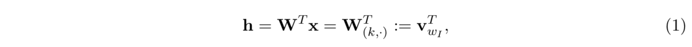
来将W的第k行复制到h。vwI是输入词汇wI的向量表示。这意味着这个隐藏层单元的链接（激活）函数是简单线性的（即直接将输入的加权和传递给下一层）。

从隐藏层到输出层，有一个不一样的N * V大小的权重矩阵W’ = {wi′j}。使用这些权重值，我们可以为词汇表里的每一个单词计算出一个分数uj。
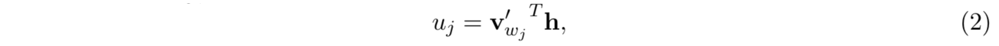
这里的v′Wj是矩阵W’的第j列。然后我们可以利用softmax，一个对数线性分类模型，来获得单词的后验分布（一种多项分布）。

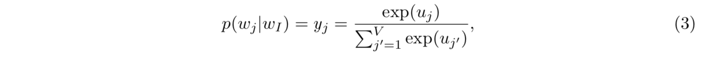
这里的yj是输出层中第j个单元（the j-the unit）的输出。我们把（1）和（2）代入（3）得到
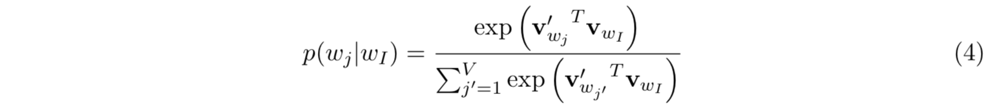
注意，这里vw和v'w是单词w的两种表示。vw来自输入到隐藏层的权重矩阵W的行，v'w来自隐藏层到输出层的矩阵W’的列。在后面的分析中，我们把vw叫做单词w的“输入向量”，把v'w叫做单词w的“输出向量”。

#### 隐藏层到输出层的权重更新公式

现在让我们推导出这个模型的权重更新公式。虽然实际的计算是不现实的（下面会进行解释），但洞察这个原始模型也不需要投机取巧。附录A中介绍了反向传播的基础知识。

训练的目标（对于一个训练样本来说）是使公式（4）的值，给定关于权重的输入上下文单词wI得到特定的输出单词wO（将其在输出层的索引表示为j*）的条件概率，达到最大。

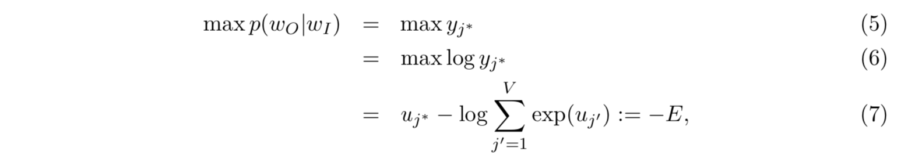
这里的 E = -log p(wO|wI)是我们的损失函数（我们想要让E最小），并且j*是输出层中某个特定输出单词的索引。注意，这个损失函数可以被理解为两个概率分布之间的交叉熵测量的一种特殊情况。

现在让我们推导出隐藏层和输出层之间的权重更新公式。关于第j个单元的净输入uj取E的导数，我们得到
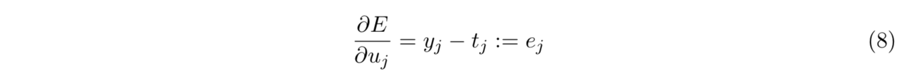
这里的tj = 1 (j = j*)，即，tj的值在第j个单元是特定的输出单词时将永远为1，否则tj = 0。注意，这个推导只是输出层的预测误差ej。

然后我们利用在wi'j上的导数来得到隐藏层到输出层权重的梯度
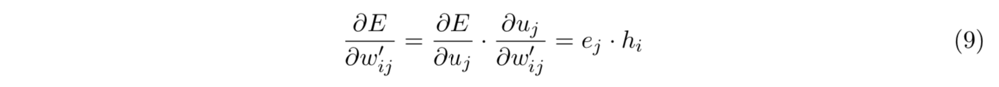

由此，使用随机梯度下降算法，我们得到了隐藏层到输出层权重的权重更新公式
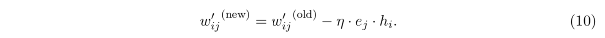
或
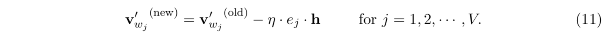
这里的 η > 0 是学习率，ej = yj - tj，hi是隐藏层的第i个单元；v'wj是wj的输出向量。注意，这个更新公式意味着我们需要遍历单词表里的所有可能的单词，检查他们的输出概率yj，与他们的期望输出tj（0或1）进行比较。如果yj > tj（“高估”），我们就从v’wj中减去一部分隐藏向量h（即vwI），这样使v'wj与vwI差距更大；如果yj < tj（“低估”，仅当tj = 1的时候为真，即wj = wO的时候），我们向v'wO中加一些h，这样使v'wO更接近[3](#fn3)vwI。如果yj与tj非常接近，根据更新公式，将会使权重发生非常微小的变化。再次注意，vw（输入向量）和v‘w（输出向量）是单词w的两种向量表示

#### 输入层到隐藏层的权重更新公式

得到了W’的更新公式后，我们将目标移向W。我们在隐藏层的输出上取E的导数，得到
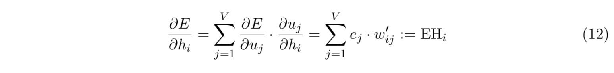
这里hi是隐藏层第i个单元的输出；uj在公式（2）中定义，是输出层第j个单元的净输入；ej = yj - tj 是输出层第j个单词的预测误差。EH，一个N维向量，是单词表里所有单词输出向量的和，由它们的预测误差加权。

接下来，我们需要将E的导数代入W。首先，回想一下隐藏层对输入层的值进行的线性计算。扩展公式1中的向量符号，我们得到
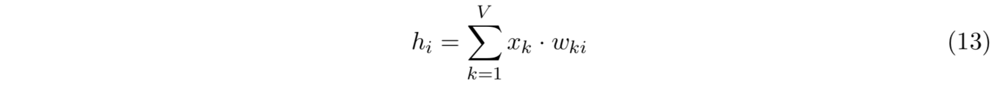

现在我们可以在W的每一个元素上取E的导数，得到
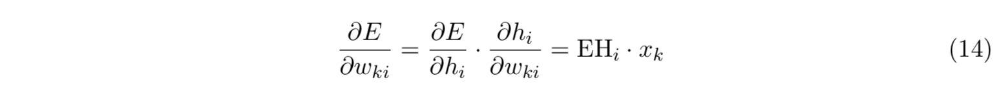

这与x和EH的向量积是相等的，即，
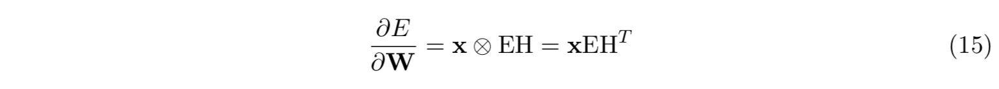
从这里我们可以得到一个V * N的矩阵。由于x中只有一个元素是非零的，所以（∂E/∂W）中只有一行是非零的，并且这一行的值为一个N维向量EHT。我们得到W的更新方程为
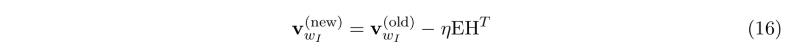
这里的vWI是W中的一行，那个唯一上下文单词的输入向量，也是W中导数不为零的唯一一行。这次迭代后，W中其他的所有行将保持不变，因为他们的导数是零。

直观来讲，由于向量EH是单词表中所有单词由他们的预测误差 ej = yj - tj 加权的输出向量的和，我们可以将公式16理解为向上下文单词的输入向量中添加单词表中每个输出向量的一部分。如果，在输出层中，一个单词wj作为输出单词的概率被高估了（yj > tj），那么上下文单词的输入向量wI将趋向于向远离wj的输出向量的方向移动；相反地，如果wj作为输出单词的概率被低估了（yj < tj），那么输入向量wI将趋向于向接近wj的输出向量的方向移动；如果wj作为输出单词的概率被相当准确地预测，那么他将对wI的输入向量的移动产生很小的影响。wI的输入向量的移动取决于词汇表里所有向量的预测误差；预测误差越大，一个单词在上下文单词输入向量的移动中施加的影响越显著。

当我们通过遍历从一个训练语料库生成的上下文-目标单词对来迭代更新模型参数时，对向量的影响将不断积累。我们可以想象，一个单词w的输出向量是被w在不同环境下相邻单词的输入向量来回“拖动”的，就像在w和相邻单词的向量之间有真的绳子一样。相似地，一个输入向量也可以看成是被很多输出向量拖动的。这种理解可以让我们想起重力，或力导向布局图。每根假想绳的平衡长度与各个相关词对之间的共同出现强度以及学习率有关。在多次迭代之后，输入向量和输出向量的相对位置将最终稳定下来。

### 1.2 多个上下文单词

## 文章中的注脚
1、可以从这里查看这个演示: http://bit.ly/wevi-online.

## 参考文献

Mikolov, T., Chen, K., Corrado, G., and Dean, J. (2013a). Efficient estimation of word representations in vector space. arXiv preprint arXiv:1301.3781.